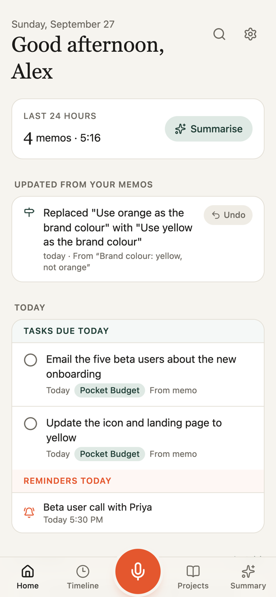
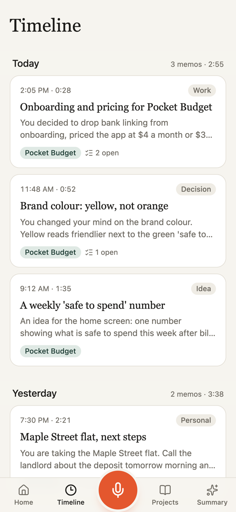
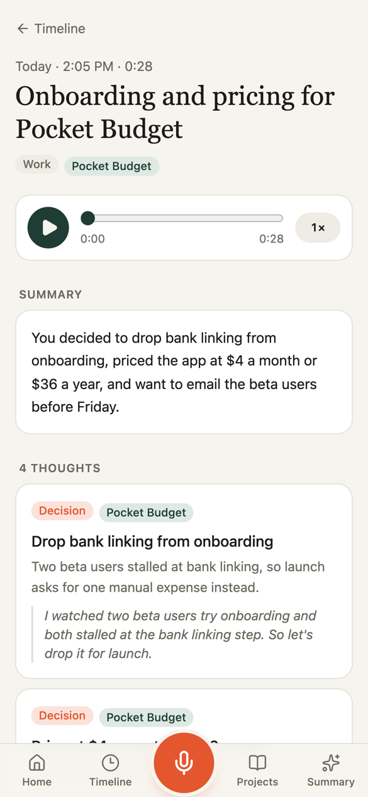
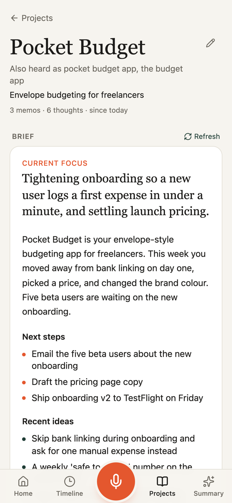
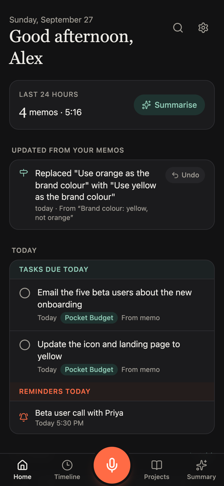
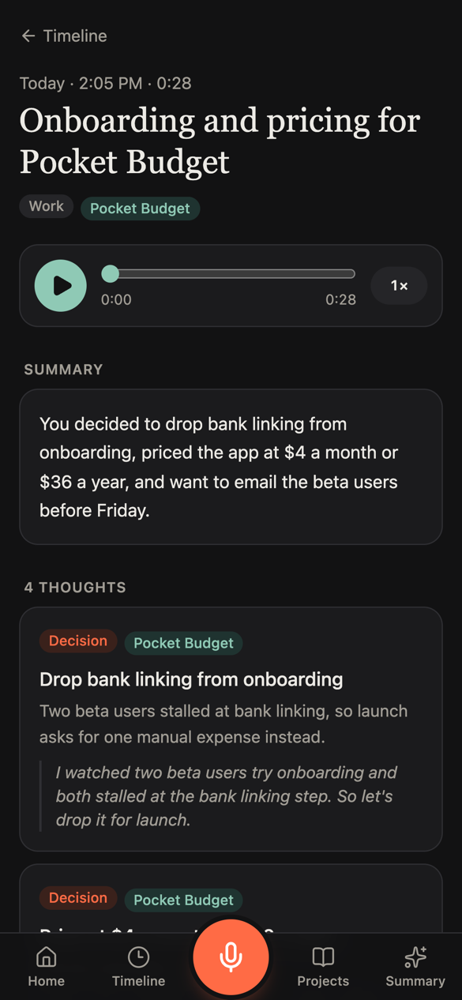

<p align="center">
  
</p>

<h1 align="center">Voice Memo</h1>

<p align="center"><b>Talk. It does the filing.</b></p>

<p align="center">
  <a href="https://github.com/hussaintrawadi/voice-memo/actions/workflows/tests.yml"></a>
  <a href="LICENSE"></a>
  
  
  
</p>

<p align="center">
  
  
  
  
</p>

A voice-first second brain. Record a thought and it gets transcribed, cleaned up, split into ideas, tasks, decisions and questions, filed into projects, and indexed so you can search it by meaning. Ask Claude about it through the built-in MCP connector.

It runs entirely on free tiers: Cloudflare (Workers, D1, R2, Vectorize, Workflows, KV, Workers AI) plus free AI APIs (Groq first, with fallbacks). No servers of your own, and nothing runs on your laptop. See [docs/ARCHITECTURE.md](docs/ARCHITECTURE.md) for how it works, and its limits.

## Why

I think out loud. Ideas, tasks and decisions show up while I am walking or driving, and a folder of voice notes never gets listened to again.

So I built Voice Memo. You talk, and it does the filing: the task lands on your list, the decision lands on the project, and when you change your mind in a later memo, the old one is updated for you.

## What it does

- **Capture anywhere.**
  - Web app: installable, works offline, keeps an upload queue.
  - Android app: a native recorder that keeps going with the screen off, plus a background upload queue.
  - Mac app: a menu-bar recorder with a global shortcut.
- **Understands what you said.**
  - Transcription in English, Hindi and Hinglish, with your own names and terms kept correct.
  - A summary for each memo, plus the thoughts, action points, decisions, open questions and reminders in it.
- **Keeps up when you change your mind.** Each new memo is compared with what's already open. Say "yellow, not orange" or "build ABC instead of XYZ" and the old decision is marked replaced, the old task comes off your list, a reminder you no longer need is cancelled and an answered question is closed. Every change shows on Home and on the memo, with Undo.
- **Projects.** Everything you say about a project lands on its own page, with a brief that rewrites itself after each memo. Misheard names are matched to the right project.
- **Today, then everything else.** The home screen opens with today's action points and reminders, with the full lists below.
- **Action points.** Add them by hand or let a memo create them, then edit the title, due date and project in place: long-press on a phone, double-click, right-click or the pencil on a computer.
- **Summaries** for any date range: today, the last 7, 15 or 30 days, or custom.
- **Search** by meaning and by keyword.
- **Reminders that ring.** Say "remind me…" in a memo, ask Claude, or add one in the app. On Android it rings like an alarm, full screen over the lock screen, until you press Done or Snooze. On the Mac a floating alert with sound appears on every desktop. Reminders the AI heard in a memo wait for one tap ("Set this reminder?") before they can ring. Everything works offline.
- **Claude connector.** A remote MCP server at `/mcp`, protected by OAuth, with 14 tools. Claude can:
  - read your memos, projects and summaries
  - add action points and notes
  - set reminders

## Layout

```
src/                React UI shared by web, Android and the Mac window
android/            Capacitor Android app + native recorder, uploader and reminders (Java)
apps/macos/         SwiftUI Mac app: web window + menu-bar recorder + notifications
worker/             Cloudflare Worker (Hono API, email/password auth, cron)
worker/ai/          provider adapters + quota-aware router with fallback
worker/pipeline/    Workflow: transcribe → clean → understand → embed
worker/insights/    project briefs and date-range summaries
worker/mcp/         Claude connector: MCP tools + OAuth sign-in page
worker/notify/      reminder dispatch (and optional FCM push)
migrations/         D1 schema
tests/              unit tests (vitest)
eval/scripts/       live smoke tests against the AI providers
```

## Deploy your own

You need a Cloudflare account (the Workers Free plan is enough) and a free [Groq](https://console.groq.com) API key. Cloudflare asks for a payment method before it switches on R2 storage; the free tier (10 GB) costs nothing, and the app caps itself at 8 GB.

1. Install, log in, and make your own config:

   ```bash
   npm install
   npx wrangler login
   cp wrangler.example.jsonc wrangler.jsonc
   ```

   `wrangler.jsonc` is git-ignored, so the ids below stay yours.

2. Create the resources. Each command prints an id; paste it into `wrangler.jsonc` where the
   matching `PUT-YOUR-…` placeholder sits.

   ```bash
   npx wrangler d1 create voice-memo-db
   npx wrangler r2 bucket create voice-memo-audio
   npx wrangler vectorize create voice-memo-thoughts --dimensions=384 --metric=cosine
   npx wrangler kv namespace create voice-memo-oauth
   ```

   Then the development set, so nothing you try locally can reach your real memos:

   ```bash
   npx wrangler d1 create voice-memo-db-dev
   npx wrangler r2 bucket create voice-memo-audio-dev
   npx wrangler vectorize create voice-memo-thoughts-dev --dimensions=384 --metric=cosine
   npx wrangler kv namespace create voice-memo-oauth-dev
   ```

3. Set the secrets:

   ```bash
   npx wrangler secret put SETUP_CODE     # creates your account once; also the password-reset key
   npx wrangler secret put APP_SECRET     # a long random string; never change it
   npx wrangler secret put GROQ_API_KEY
   ```

   The optional fallbacks and extras are `DEEPGRAM_API_KEY`, `MISTRAL_API_KEY`, `SARVAM_API_KEY` and `FCM_SERVICE_ACCOUNT`. The last one is for instant Android push; see below.

4. Create the database tables and deploy:

   ```bash
   npm run db:migrate:remote
   npm run deploy
   ```

5. Open the Worker URL, enter your setup code, and create your account. Voice Memo is single-user: the first account is the only one.

## Apps

Write your Worker URL to `.voice-memo-url` (it's git-ignored). Both build scripts read it:

```bash
echo "https://voice-memo.<your-subdomain>.workers.dev" > .voice-memo-url
```

**Android.** Run `scripts/android-build.sh`. It needs the Android SDK and Java 21, and Android Studio ships both. The script creates a signing key the first time; back up `android/voice-memo-release.keystore`, because updates need the same key. The APK lands in `android/app/build/outputs/apk/release/`.

**Mac.** Run `apps/macos/build.sh`. It builds `apps/macos/build/Voice Memo.app`, ad-hoc signed for your own Mac.

## Connect Claude

In Claude, open Settings → Connectors → Add custom connector. Enter `https://<your-worker>/mcp` and sign in with your Voice Memo email and password when asked. You can see and revoke connected apps under Settings → Claude in the app.

## Reminders on your phone

The Android and Mac apps sync upcoming reminders and ring them on the device, so they work offline. Android uses the system alarm clock, the alarm sound and a full-screen alert; allow notifications when asked. A reminder set from Claude reaches the phone at its next sync, which happens when the app opens, after an upload, or every 15 minutes.

For instant delivery:
1. Create a free Firebase project.
2. Put the service account JSON in the `FCM_SERVICE_ACCOUNT` secret.
3. Add the app's `google-services.json`.

## Develop

```bash
npm run db:migrate:local
npm run dev
```

`npm run dev` uses the `dev` environment in `wrangler.jsonc`, which points at the `-dev` resources:
- D1, R2, KV and Workflows are simulated on your machine.
- Workers AI and the `voice-memo-thoughts-dev` vector index are remote, because neither has a local simulator.

Keeping dev on its own resources matters: a command that reaches the network (anything with `--remote`) then cannot touch your real memos.

Local secrets go in `.dev.vars` (git-ignored); see `.dev.vars.example`. To test the Mac app against the dev server, launch it with `--args -baseURL http://localhost:5174`.

## Checks

```bash
npm run typecheck   # regenerates worker-configuration.d.ts from wrangler.jsonc first
npm test
```

## Privacy

- **Audio.** Recordings go to the AI providers you configure. By default, only providers that say they don't train on API data are used. Audio is deleted after 30 days.
- **Your data.** Transcripts and notes stay in your own Cloudflare account.

## Screenshots

Light and dark follow your system setting.

<p align="center">
  
  
</p>

The screenshots use made-up demo data.

## Contributing

Issues and pull requests are welcome. See [CONTRIBUTING.md](CONTRIBUTING.md). For security problems, see [SECURITY.md](SECURITY.md).

## License

[MIT](LICENSE). Built by [Hussain Trawadi](https://github.com/hussaintrawadi).
